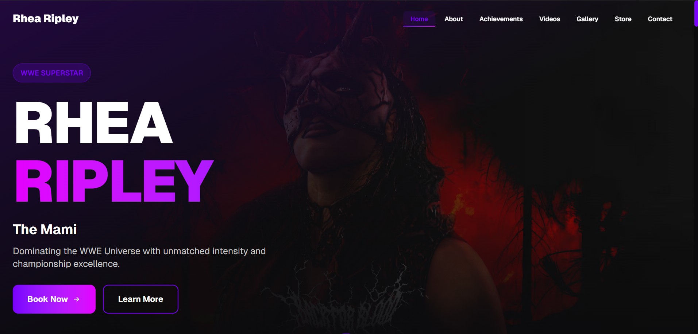
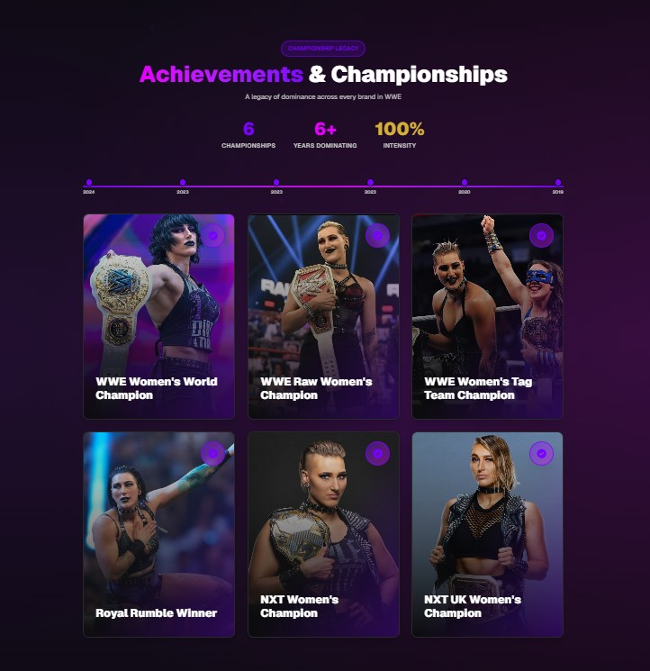
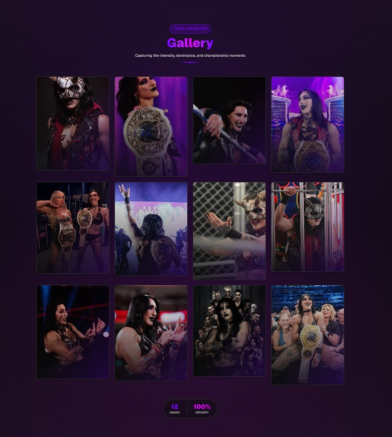
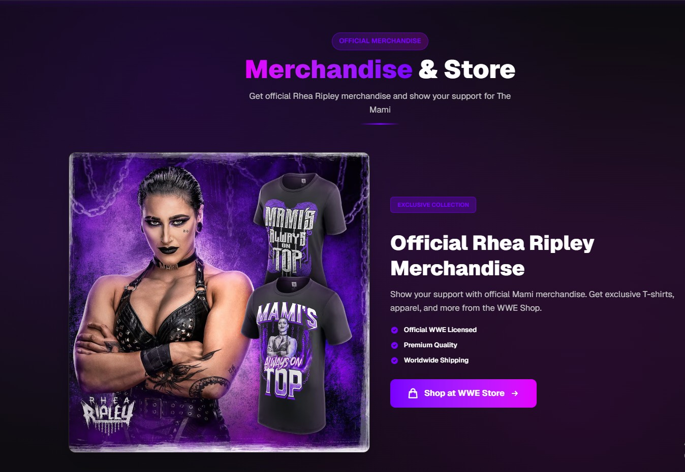

# Ripley-UI

A modern, fan-style portfolio / showcase static website built with HTML/CSS/JS — inspired by a wrestling-superstar theme.  

## 🔗 Live Demo

Check out the live deployed version here:  
👉 **https://ripley-ui.vercel.app**

---

## 🖼️ Screenshots

### 🏠 Home / Hero Section

### 🏆 Achievements

### 🎥 Video Highlights

### 🖼️ Gallery

### 🛍️ Merchandise Section

## 🚀 What is this project

Ripley-UI is a responsive, visually engaging single-page website that displays:  
- Home / Hero section  
- About section  
- Achievements & Championships  
- Video highlights  
- Gallery  
- Store / Merchandise placeholder  
- Contact / Booking information  

It can be used as a personal portfolio, a fan page, or a template to build similar showcase sites.

---

## 🧩 Features

- Responsive layout for desktop and mobile  
- Navigation menu with smooth scrolling  
- Sections for about, achievements, videos, gallery, store, contact  
- Support for images, embedded videos, and external links  
- Easy to customize HTML/CSS/JS — no build tools required  
