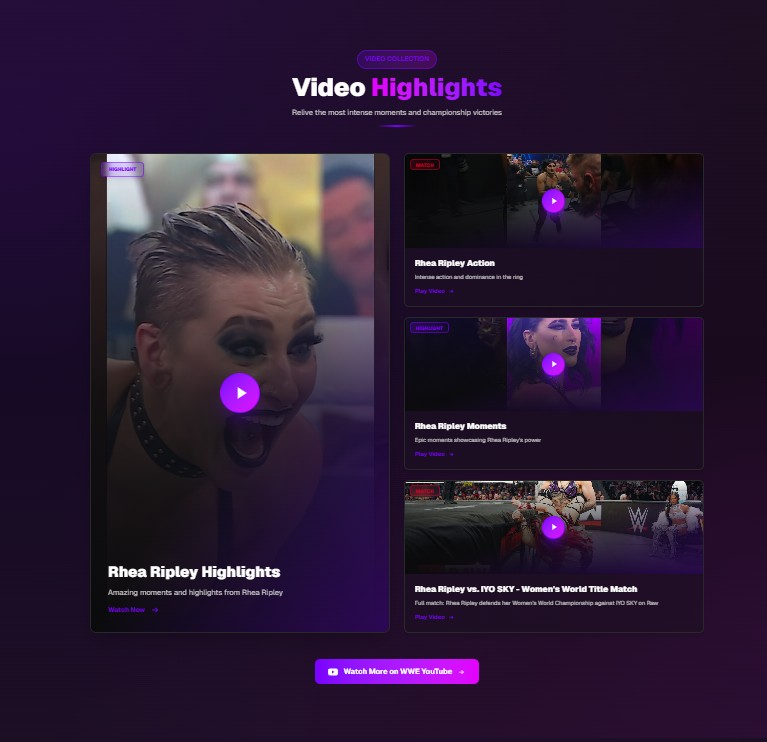

# Rhea Ripley - WWE Superstar Portfolio Website

A modern, high-performance portfolio website for WWE Superstar Rhea Ripley built with Next.js, TypeScript, and Tailwind CSS. Features a stunning dark theme with purple accents, smooth animations, and optimized performance.


## ✨ Features

- 🎨 **Modern UI/UX** - Beautiful dark theme with purple/magenta accents inspired by Rhea Ripley's WWE persona
- ⚡ **Lightning Fast** - Optimized for performance with code splitting, lazy loading, and image optimization
- 📱 **Fully Responsive** - Perfect experience on all devices (mobile, tablet, desktop)
- 🎭 **Smooth Animations** - GPU-accelerated animations and transitions
- 🖼️ **Image Gallery** - Interactive gallery with lightbox modal
- 🎥 **Video Highlights** - Embedded YouTube videos with custom player
- 🏆 **Achievements Showcase** - Interactive championship cards with 3D tilt effects
- 🛍️ **Merchandise Section** - Official WWE shop integration
- 📧 **Contact Section** - Social media links and contact information

## 🚀 Tech Stack

- **Framework**: [Next.js 16](https://nextjs.org/) with App Router
- **Language**: [TypeScript](https://www.typescriptlang.org/)
- **Styling**: [Tailwind CSS 4](https://tailwindcss.com/)
- **UI Components**: Custom React components
- **Fonts**: [Geist Sans & Geist Mono](https://vercel.com/font)
- **Image Optimization**: Next.js Image component with AVIF/WebP support
- **Performance**: React.memo, code splitting, lazy loading, throttled event handlers

## 📦 Installation

1. **Clone the repository**
   ```bash
   git clone https://github.com/yourusername/ripley-ui.git
   cd ripley-ui
   ```

2. **Install dependencies**
   ```bash
   npm install
   ```

3. **Run the development server**
   ```bash
   npm run dev
   ```

4. **Open your browser**
   Navigate to [http://localhost:3000](http://localhost:3000)

## 🛠️ Available Scripts

- `npm run dev` - Start development server
- `npm run build` - Build for production
- `npm start` - Start production server
- `npm run lint` - Run ESLint

## 📁 Project Structure

```
ripley-ui/
├── app/
│   ├── layout.tsx          # Root layout with metadata
│   ├── page.tsx            # Main page component
│   └── globals.css         # Global styles
├── components/
│   ├── Navbar.tsx          # Navigation bar
│   ├── Hero.tsx            # Hero section
│   ├── About.tsx           # About section
│   ├── Featured.tsx        # Featured match section
│   ├── Achievements.tsx    # Achievements showcase
│   ├── VideoHighlights.tsx # Video collection
│   ├── Gallery.tsx         # Image gallery
│   ├── Merchandise.tsx     # Merchandise section
│   ├── Contact.tsx         # Contact section
│   └── Footer.tsx          # Footer
├── constants/
│   ├── achievements.ts     # Achievement data
│   ├── gallery.ts         # Gallery images
│   ├── videos.ts          # Video data
│   └── merchandise.ts     # Merchandise data
├── public/
│   ├── images/            # Static images
│   └── gallery/           # Gallery images
├── utils/
│   └── throttle.ts        # Performance utilities
└── next.config.ts         # Next.js configuration
```

## 🎨 Design Features

### Color Scheme
- **Background**: Deep black (#0B0B0D)
- **Primary Purple**: #7A00FF
- **Magenta**: #E400FF
- **Gold**: #D4AF37 (for championships)
- **Red**: #D40027 (for matches)

### Key Sections
1. **Hero** - Full-screen hero with dynamic spotlight effect
2. **About** - Two-column layout with feature cards
3. **Featured** - Large featured match showcase
4. **Achievements** - Interactive championship cards with 3D effects
5. **Video Highlights** - Grid layout with category filters
6. **Gallery** - Masonry-style grid with lightbox
7. **Merchandise** - Two-column layout with hero image
8. **Contact** - Social links and contact information

## ⚡ Performance Optimizations

- **Code Splitting**: Dynamic imports for below-the-fold components
- **Image Optimization**: Next.js Image with AVIF/WebP formats
- **Lazy Loading**: Images and components load on demand
- **Event Throttling**: Mouse events throttled to 16-100ms
- **React.memo**: Components memoized to prevent unnecessary re-renders
- **GPU Acceleration**: CSS transforms with `transform-gpu`
- **Intersection Observer**: Optimized scroll animations
- **Font Optimization**: Font display swap for faster rendering

## 📸 Screenshots

### 🏠 Home / Hero Section


### 🏆 Achievements


### 🎥 Video Highlights


### 🖼️ Gallery


### 🛍️ Merchandise Section


## 🔧 Configuration

### Image Domains
Configured in `next.config.ts` for external images:
- `images.unsplash.com`
- `img.youtube.com`
- `i.ytimg.com`

### Environment Variables
No environment variables required for basic functionality.

## 📝 Customization

### Adding New Content

1. **Achievements**: Edit `constants/achievements.ts`
2. **Gallery Images**: Add to `public/gallery/` and update `constants/gallery.ts`
3. **Videos**: Update `constants/videos.ts` with YouTube video IDs
4. **Merchandise**: Modify `constants/merchandise.ts`

### Styling
- Colors: Defined in `tailwind.config.ts` and `app/globals.css`
- Animations: Custom keyframes in component styles
- Responsive breakpoints: Tailwind default (sm, md, lg, xl)

## 🚀 Deployment

### Vercel (Recommended)
1. Push your code to GitHub
2. Import project in [Vercel](https://vercel.com)
3. Deploy automatically

### Other Platforms
```bash
npm run build
npm start
```

## 🤝 Contributing

Contributions are welcome! Please feel free to submit a Pull Request.

1. Fork the repository
2. Create your feature branch (`git checkout -b feature/AmazingFeature`)
3. Commit your changes (`git commit -m 'Add some AmazingFeature'`)
4. Push to the branch (`git push origin feature/AmazingFeature`)
5. Open a Pull Request

## 📄 License

This project is a fan-made portfolio website. All WWE content, images, and trademarks are property of WWE, Inc. This is not an official WWE website.

## 🙏 Acknowledgments

- WWE for the amazing content and imagery
- Rhea Ripley for being an inspiration
- Next.js team for the amazing framework
- Tailwind CSS for the utility-first CSS framework

## 📧 Contact

For questions or suggestions, please open an issue on GitHub.

---

**Note**: This is a fan-made portfolio website. Not affiliated with WWE, Inc.
